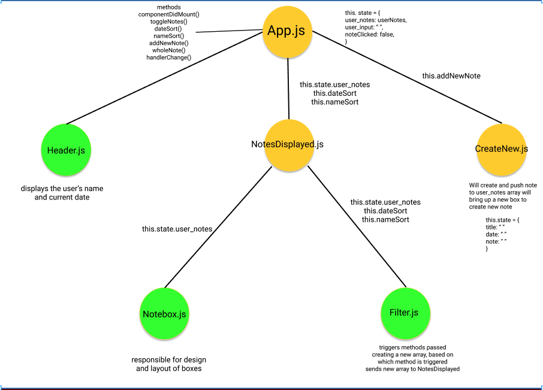
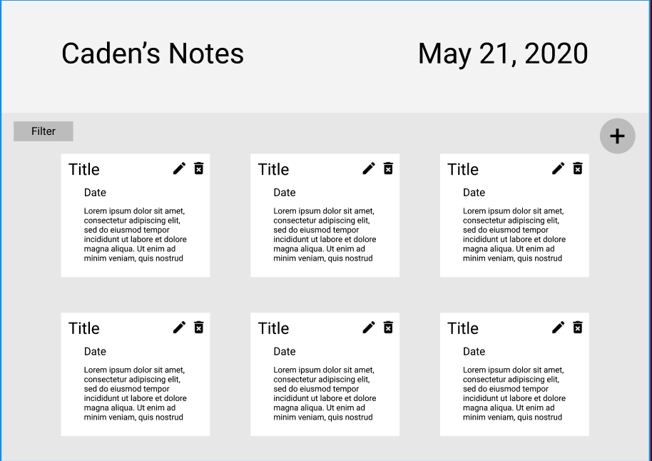
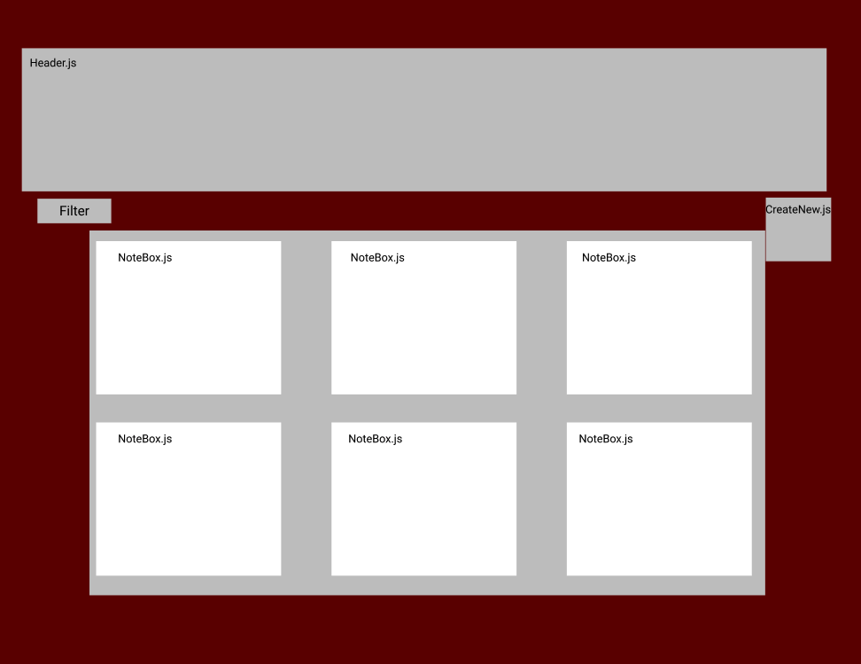

# NoDb Project
## Sticky Note Application

### Application Concept
- This app allows you to create, store, edit, and delete your notes.
- This will be using data I've created in a JSON file
- Full CRUD
    - GET: Display all notes taken
    - GET: Access a specific note by searching the title, date, or id (query)
    - POST: Create a new note and post it to previously added notes
    - PUT: Edit and change previous notes you have taken
    - DELETE: Self explanatory but gives the option to delete the specified note

### Functionality
- A header at the top, displaying the name of the user and the current date. For example, Caden's Notes May 21, 2020
- The app will display the user's notes (six at a time below the header)
- Each box will display the title and date of the note
- Each box will also have two buttons: An edit and delete. 
- When the note is updated it will also update the note's date to the current date and move it to the front of the array

### Endpoints
- GET = Get notes from the stored notes JSON file 
- POST = Allow the user to create a new note and push the new note to the front 
- PUT = edits the selected post and pushes the modified version to the front
- DELETE = deletes the selected note

### Component Architecture
- App.js (stateful: stores the user's notes array)
- Header.js (functional)
- NotesDisplayed.js (funtional: displays a selected number of users notes stored in the array)
    - Filter.js (functional: contains a button or dropdown menu to filter the notes by date created/modified or by name)
    - NoteBox.js (functional: takes care of the size of the boxes and displays the title, body, and date of each note)
- CreateNew.js (stateful: displays the create new button and contains code to put the array at the top)

### Wireframe

